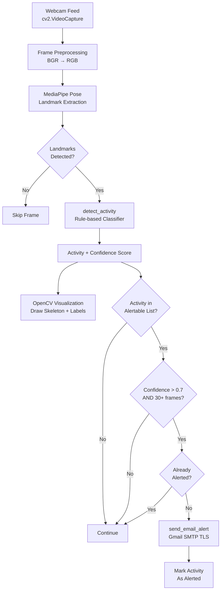

# 🤸 Real-Time Human Activity Recognition with Anomaly Detection

<p align="center">
  <!-- Replace with an actual banner/screenshot of the running system -->
  
</p>

<p align="center">
  <strong>Pose-landmark-based activity recognition from live webcam using MediaPipe & OpenCV — with automated email alerts for anomalous behavior.</strong>
</p>

<p align="center">
  
  
  
  
  
  
</p>

---

## 📌 Table of Contents

- [Project Overview](#-project-overview)
- [Features](#-features)
- [Demo](#-demo)
- [Architecture](#-architecture)
- [Detected Activities](#-detected-activities)
- [Anomaly Alert System](#-anomaly-alert-system)
- [Tech Stack](#-tech-stack)
- [Installation](#-installation)
- [Environment Variables](#-environment-variables)
- [Running the Project](#-running-the-project)
- [Code Structure](#-code-structure)
- [Challenges & Solutions](#-challenges--solutions)
- [Roadmap](#-roadmap)
- [Contributing](#-contributing)
- [License](#-license)
- [Contact](#-contact)

---

## 📖 Project Overview

This project performs **real-time human activity recognition** from a live webcam feed using **Google MediaPipe Pose** landmarks. It classifies human body movement into six activities and flags anomalous behaviors (Boxing, Running) by sending a **one-time automated email alert** to a configured recipient.

### Who It's For

- Researchers exploring pose-based activity recognition
- Security and surveillance system developers
- Students building ML/CV portfolios targeting IEEE/SCOPUS publication
- Developers integrating health or workplace safety monitoring

### Why It Exists

Traditional video-based activity recognition systems require heavy deep learning pipelines and GPUs. This system achieves competitive real-time classification using only pose landmarks and rule-based heuristics — making it lightweight, interpretable, and easy to extend.

---

## ✨ Features

### 🎯 Activity Recognition
- Classifies **6 human activities** from live webcam in real time
- Uses **33 MediaPipe Pose landmarks** for body tracking
- Calculates joint **angles**, **wrist distances**, **knee distances**, and **movement deltas** across frame windows
- Returns a **confidence score** (0.0–1.0) per classification

### 🚨 Anomaly Detection & Email Alerting
- Monitors for **Boxing** and **Running** as anomalous activities
- Triggers an alert only after an activity sustains for **30+ consecutive frames** above a **0.7 confidence threshold**
- Sends a **one-time email alert per activity per session** (no spam)
- Uses Gmail SMTP with TLS for secure email delivery
- Timestamps and labels alerts with activity name and confidence level

### 🖥️ Real-Time Visualization
- Draws **MediaPipe pose skeleton** overlay on the live webcam frame
- Displays **activity label**, **confidence score**, and **FPS counter** on screen
- Color-codes activity labels per activity type
- Shows "ANOMALY DETECTED!" overlay when an alert-worthy activity is confirmed
- Displays alert-sent status for each anomalous activity type

### 🔧 Developer-Friendly Design
- Graceful webcam initialization with fallback across multiple device indices
- Configurable **alert threshold**, **alertable activities list**, and **email credentials** via environment variables
- Clean separation of detection logic, visualization, and alert dispatch

---

## 🎬 Demo

> **Replace these placeholders with actual screenshots or GIFs from your system.**

| Live Detection | Anomaly Alert Overlay |
|---|---|
|  |  |

---

## 🏗️ Architecture



---

## 🏃 Detected Activities

| Activity | Detection Logic | Confidence Basis |
|---|---|---|
| **Sitting** | Hip-knee angle < 120° on both sides; knee height > 0.6 | Angle deviation from 120° |
| **Boxing** | Wrist extends beyond 1.2× shoulder width; 3+ punches in last 10 frames; hand movement > 0.15 | Hand movement magnitude |
| **Running** | Body movement > 0.15; knee lateral distance > 0.25 | Body movement magnitude |
| **Clapping** | Wrist distance < 0.15; hand movement > 0.1 | Inverse of wrist distance |
| **Walking** | Body movement > 0.1; knee distance > 0.2 (below running threshold) | Body movement magnitude |
| **Standing** | None of the above conditions met | Inverse of body movement |

---

## 📧 Anomaly Alert System

The system defines **Boxing** and **Running** as anomalous activities (configurable via `alertable_activities`).

**Alert Trigger Logic:**
1. Activity must be in `alertable_activities`
2. Confidence must exceed `alert_threshold` (default: `0.7`)
3. Activity must persist for **>30 consecutive frames**
4. Activity must not have already triggered an alert in this session (`alerted_activities` set)

**Email Content Includes:**
- Activity name
- Confidence score
- Timestamp (`YYYY-MM-DD HH:MM:SS`)
- Sender attribution

---

## 🛠️ Tech Stack

| Layer | Technology |
|---|---|
| **Pose Estimation** | [MediaPipe Pose](https://google.github.io/mediapipe/solutions/pose) |
| **Computer Vision** | [OpenCV (cv2)](https://opencv.org/) |
| **Numerical Computation** | [NumPy](https://numpy.org/) |
| **Email Delivery** | Python `smtplib` + `email.mime` (Gmail SMTP, TLS) |
| **Language** | Python 3.8+ |
| **Data Structures** | `collections.deque` for sliding window position history |

---

## ⚙️ Installation

### Prerequisites

- Python 3.8 or higher
- A working webcam
- A Gmail account (for sending alerts)

### Steps

```bash
# 1. Clone the repository
git clone https://github.com/your-username/har-anomaly-detection.git
cd har-anomaly-detection

# 2. Create and activate a virtual environment (recommended)
python -m venv venv
source venv/bin/activate        # macOS/Linux
venv\Scripts\activate           # Windows

# 3. Install dependencies
pip install mediapipe opencv-python numpy

# 4. Set up environment variables (see section below)
```

---

## 🔐 Environment Variables

Create a `.env` file in the project root or export these variables in your shell before running.

| Variable | Description | Example |
|---|---|---|
| `ALERT_EMAIL` | Gmail address used to **send** alert emails | `you@gmail.com` |
| `ALERT_PASSWORD` | Gmail **App Password** (not your account password) | `xxxx xxxx xxxx xxxx` |

> ⚠️ **Never commit real credentials to version control.** Use [Gmail App Passwords](https://support.google.com/accounts/answer/185833) — standard account passwords won't work with SMTP if 2FA is enabled.

```bash
# Export in terminal (Linux/macOS)
export ALERT_EMAIL="your_email@gmail.com"
export ALERT_PASSWORD="your_app_password"

# Or add to .env and load with python-dotenv (optional enhancement)
```

---

## ▶️ Running the Project

```bash
python activity_recognition.py
```

**On startup, the system will:**
1. Prompt you to enter a **recipient email address** for alerts
2. Open the webcam (tries indices 0, 1, 2 automatically)
3. Begin real-time pose detection and activity classification
4. Display the annotated video window
5. Send email alerts as anomalous activities are detected

**Controls:**
- Press `q` to quit and release the webcam

---

## 📁 Code Structure

```
har-anomaly-detection/
│
├── activity_recognition.py     # Main script — all logic lives here
│
├── assets/                     # (Placeholder) Screenshots and demo GIFs
│   ├── banner.png
│   ├── demo_detection.gif
│   └── demo_alert.gif
│
├── .env                        # (Git-ignored) Email credentials
├── .gitignore
└── README.md
```

### Key Functions

| Function | Purpose |
|---|---|
| `detect_activity(landmarks)` | Rule-based classifier; returns `(activity_name, confidence)` |
| `calculate_angle(a, b, c)` | Computes joint angle from three MediaPipe landmark points |
| `calculate_movement(positions, history)` | Computes mean movement across a deque of position frames |
| `send_email_alert(activity, confidence, recipient)` | Dispatches one-time Gmail SMTP alert |
| `get_activity_color(activity)` | Maps activity labels to BGR display colors |
| `main()` | Webcam loop — orchestrates capture, inference, visualization, and alerting |

---

## 🧩 Challenges & Solutions

### 1. Occlusion & Missing Landmarks
**Problem:** When a person's lower body is outside the camera frame, landmark coordinates still exist but with very low visibility, causing false classifications.

**Solution:** Added an explicit visibility check — all 6 required lower-body landmarks must have `visibility > 0.5` before any classification runs. If the check fails, the system returns `"No Activity Detected"` with zero confidence.

---

### 2. Alert Spam Prevention
**Problem:** Once an anomalous activity like Boxing is detected, it would trigger email alerts on every subsequent frame.

**Solution:** A two-layer gate: (a) `alerted_activities` set tracks which activities have been alerted **in the current session**; (b) the activity must sustain for **30+ consecutive frames** above threshold before the first alert fires. This eliminates transient false positives and limits alerts to exactly one per activity.

---

### 3. Activity Overlap Between Walking and Running
**Problem:** The body movement features used for Walking and Running overlap at moderate speeds.

**Solution:** Added a secondary discriminant — `knee_distance > 0.25` is required for Running (vs. `> 0.20` for Walking), capturing the wider lateral leg separation that characterizes a running gait.

---

### 4. Webcam Device Index Uncertainty
**Problem:** Different operating systems enumerate webcam devices differently (index 0 vs. 1 vs. 2).

**Solution:** The `main()` function loops through indices 0–2 and breaks on the first successful `cap.isOpened()`, making the script portable across Linux, macOS, and Windows setups.

---

## 🗺️ Roadmap

- [x] Real-time pose detection via MediaPipe
- [x] Rule-based classification for 6 activities
- [x] Confidence scoring per activity
- [x] Anomaly detection for Boxing and Running
- [x] One-time email alert via Gmail SMTP
- [x] Persistent alert status display on video overlay
- [ ] Replace rule-based classifier with trained ML model (SVM / LSTM)
- [ ] Multi-person tracking and simultaneous classification
- [ ] Crowd behavior analysis and density estimation
- [ ] Configurable alertable activities via CLI flags or config file
- [ ] Web dashboard for real-time activity monitoring
- [ ] Support for video file input (not just live webcam)
- [ ] Logging activity timeline to CSV or SQLite
- [ ] Docker containerization
- [ ] IEEE/SCOPUS research paper publication

---

## 🤝 Contributing

Contributions are welcome! Please follow these guidelines:

### Branch Naming

```
feature/your-feature-name
fix/issue-description
docs/section-name
```

### Commit Convention

```
feat: add multi-person tracking support
fix: resolve false positive in boxing detection
docs: update environment variable section
refactor: extract alert logic into separate module
```

### Pull Request Process

1. Fork the repository
2. Create your feature branch: `git checkout -b feature/your-feature`
3. Commit your changes following the convention above
4. Push to your fork: `git push origin feature/your-feature`
5. Open a Pull Request with a clear description of what was changed and why

### Reporting Issues

Please include:
- Python version and OS
- Full error traceback
- Steps to reproduce
- Expected vs. actual behavior

---

## 📄 License

This project is licensed under the **MIT License**.

```
MIT License

Copyright (c) 2025 Mahesh Babu K.

Permission is hereby granted, free of charge, to any person obtaining a copy
of this software and associated documentation files (the "Software"), to deal
in the Software without restriction, including without limitation the rights
to use, copy, modify, merge, publish, distribute, sublicense, and/or sell
copies of the Software, and to permit persons to whom the Software is
furnished to do so, subject to the following conditions:

The above copyright notice and this permission notice shall be included in all
copies or substantial portions of the Software.

THE SOFTWARE IS PROVIDED "AS IS", WITHOUT WARRANTY OF ANY KIND, EXPRESS OR
IMPLIED, INCLUDING BUT NOT LIMITED TO THE WARRANTIES OF MERCHANTABILITY,
FITNESS FOR A PARTICULAR PURPOSE AND NONINFRINGEMENT. IN NO EVENT SHALL THE
AUTHORS OR COPYRIGHT HOLDERS BE LIABLE FOR ANY CLAIM, DAMAGES OR OTHER
LIABILITY, WHETHER IN AN ACTION OF CONTRACT, TORT OR OTHERWISE, ARISING FROM,
OUT OF OR IN CONNECTION WITH THE SOFTWARE OR THE USE OR OTHER DEALINGS IN THE
SOFTWARE.
```

---

## 📬 Contact

| Platform | Link |
|---|---|
| **GitHub** | [github.com/your-username](https://github.com/your-username) |
| **LinkedIn** | [linkedin.com/in/your-profile](https://linkedin.com/in/your-profile) |
| **Portfolio** | [your-portfolio.dev](https://your-portfolio.dev) |
| **Email** | your-email@example.com |

---

<p align="center">
  Built with ❤️ using MediaPipe + OpenCV · Star ⭐ this repo if you found it useful!
</p>
